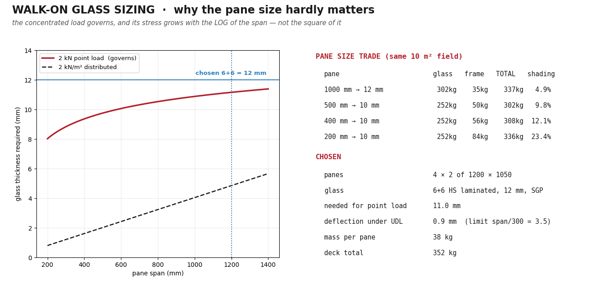

# Boat-Home — Road-Towable Solar Trimaran

A 7.2 m Dutch-barge-style boat-home that is **its own trailer**: the
stabiliser floats fold underneath the hull and carry six driven wheels,
so one Mercedes-Viano-class car tows it on German roads and it drives
itself in and out of the water on a slipway. Solar-electric, weed-proof
waterjets, and a walk-on glass sun deck — you stand on the glass, the
panels live safely underneath it.

Parametric CAD in FreeCAD (Python-scripted); every legal, structural
and hydrostatic constraint is asserted in code, so a dimension cannot
drift without the build failing.


---

## 1. Principal dimensions

| | |
|---|---|
| Length over hull | **7 200 mm** |
| Length with drawbar out | **9 094 mm** |
| Beam, hull | **2 500 mm** |
| Beam, road (folded) | **2 535 mm** (StVZO limit 2 550) |
| Beam, afloat (floats out) | **4 716 mm** |
| Height on the road | **3 009 mm** (limit 4 000) |
| Air draft afloat | **2 267 mm** |
| Draft | **260 mm** light, ~300 mm loaded |
| Displacement | 1 970 kg at the 260 mm waterline |
| Design all-up mass | 2 000 kg (see §7 — this is the tight one) |
| Ground clearance, road | 482 mm |
| Track / wheelbase | 2 270 / 3 400 mm |
| Coupling height / tongue load | 445 mm / +100 kg |

### Living quarters

| | |
|---|---|
| Cabin | 5 300 × 2 280 mm inside |
| Headroom | **1 850 mm** clear over the sole |
| Floor area | 12.1 m² |
| Berths | **5** — athwartships double, bunk (2), single settee, dinette double |
| Heads | 1 400 × 900 wetroom with shower |
| Galley | induction hob, sink, washer-dryer, full-height fridge/freezer |
| Fresh water | 200 L in a bilge tank under the sole |
| Glazing | 2 picture windows per side, 1 800 × 600 and 1 200 × 600 |


---

## 2. Performance

**Installed power: 3 × 2 kW flush-intake waterjets = 6 kW.** Estimates
from an ITTC friction line plus a residuary factor for a blunt barge
hull; wetted surface 27.3 m² in trimaran trim, 2 600 kg all-up,
waterjet propulsive efficiency 0.45. Method in
[docs/performance.md](docs/performance.md).

| Speed | Shaft power | Range on 45 kWh usable | Endurance |
|---|---|---|---|
| 2.0 kn | 0.18 kW | **500 NM** | 250 h |
| 3.0 kn | 0.56 kW | **240 NM** | 80 h |
| 3.5 kn | 1.00 kW | **157 NM** | 45 h |
| 4.0 kn | 2.09 kW | **86 NM** | 21 h |
| 4.5 kn | 4.24 kW | **48 NM** | 11 h |
| **4.8 kn max** | 6.0 kW | 33 NM | 7 h |

**Maximum ≈ 4.8 knots**, power-limited rather than hull-speed-limited
(theoretical hull speed is 6.2 kn). The last 0.3 kn costs as much power
as the first 4 — this is a boat to cruise at 3–4 kn, not to push.

**Solar-neutral cruising.** With 4.40 kWp and ≈ 24 kWh on a good summer
day, eight hours at **4.2 knots** is solar-neutral: the boat moves all day
and finishes with a fuller battery than it started. In spring or autumn
(12 kWh) that falls to 3.6 kn, and on an overcast winter day (6 kWh) to
2.7 kn.

| | |
|---|---|
| Battery | 48 V LiFePO₄, **50 kWh**, 357 kg, split under both settees |
| Solar | **4.40 kWp** — 4 × 500 W under the walk-on glass, 6 × 400 W bifacial on the balconies (4.35 kWp effective) |
| House load | ≈ 2.5 kWh/day (fridge, lights, water, AC standby) |
| Steering | differential thrust, no rudder |
| On land | ≤ 10 km/h under its own wheels; towed at road speeds |

---

## 3. The five configurations

Photo-reference renders — perspective camera, natural eye heights,
interior hidden and glazing closed so nothing reads as a cutaway — live
in `freecad/shots/beauty/`: five viewpoints per mode (bow quarter,
stern quarter, beam on, from above, low from the water), 2 800 × 1 750.
They are the plates at the front of the PDF gallery.


| Mode | What it is | Renders |
|---|---|---|
| `road` | floats folded under the hull, balconies up over the windows, towed stern-first | [bow qtr](freecad/shots/beauty/road_bow_quarter.png) · [stern qtr](freecad/shots/beauty/road_stern_quarter.png) · [beam](freecad/shots/beauty/road_beam.png) · [above](freecad/shots/beauty/road_drone.png) · [low](freecad/shots/beauty/road_low.png) |
| `launch` | driving itself down the slipway on six wheels | [bow qtr](freecad/shots/beauty/launch_bow_quarter.png) · [stern qtr](freecad/shots/beauty/launch_stern_quarter.png) · [beam](freecad/shots/beauty/launch_beam.png) · [above](freecad/shots/beauty/launch_drone.png) · [low](freecad/shots/beauty/launch_low.png) |
| `harbor` | jack-up: floats carry the boat, keel awash, tyres as rolling quay fenders | [bow qtr](freecad/shots/beauty/harbor_bow_quarter.png) · [stern qtr](freecad/shots/beauty/harbor_stern_quarter.png) · [beam](freecad/shots/beauty/harbor_beam.png) · [above](freecad/shots/beauty/harbor_drone.png) · [low](freecad/shots/beauty/harbor_low.png) |
| `cruise` | trimaran, floats out, balconies down | [bow qtr](freecad/shots/beauty/cruise_bow_quarter.png) · [stern qtr](freecad/shots/beauty/cruise_stern_quarter.png) · [beam](freecad/shots/beauty/cruise_beam.png) · [above](freecad/shots/beauty/cruise_drone.png) · [low](freecad/shots/beauty/cruise_low.png) |
| `anchor` | lying to the stern anchor | [bow qtr](freecad/shots/beauty/anchor_bow_quarter.png) · [stern qtr](freecad/shots/beauty/anchor_stern_quarter.png) · [beam](freecad/shots/beauty/anchor_beam.png) · [above](freecad/shots/beauty/anchor_drone.png) · [low](freecad/shots/beauty/anchor_low.png) |


---

## 4. Key systems

**Hangar / running gear** — one rigid welded arm per station, a single
shoulder pin, 90° swing. Road: float on its side flush under the hull,
wheels vertical. Water: float flat, wheels dry above the waterline. Six
205/70 R15 all-terrain wheels, electric-over-hydraulic drive with the
machinery sealed inside the floats. → [docs/wheels.md](docs/wheels.md)

**Jack-up stance** — the floats hold 3.1 t of buoyancy against a 2.0 t
boat, so folding the arms in deep water lifts the *hull*: the floats end
65 % submerged carrying everything and the keel rides awash. Pontoon
GM ≈ 3.1 m.

**Propulsion** — flush perforated intake grids on the float sides below
the waterline (0.5 m/s face velocity, 14 mm holes, so weed drifts past),
internal duct to an enclosed pump, tail nozzle. Nothing rotating is
reachable by weed. → [docs/propulsion.md](docs/propulsion.md)

**Exoskeleton** — an external steel ladder-loop frame carries every
point load (arms, balconies, tow, fenders); nothing structural crosses
the living volume. → [docs/structure.md](docs/structure.md)

**Roof deck** — walk-on 6+6 laminated glass over a ventilated 60 mm air
box on an aluminium grid, solar modules underneath, no moving parts.
Sized for full building-code deck loads: 2 kN/m² plus 2 kN on a
50 × 50 mm patch. → [docs/roof.md](docs/roof.md)




**Interior** — heads, galley, dinette that sleeps two, elevating double
bed forward, fold-down bunk to port; batteries and water low and
amidships. → [docs/interior.md](docs/interior.md)

**Front sky dome** — a glazed conservatory over the foredeck: half a
dome cut flat by the deck, so the deck is its floor and you walk into
it from the saloon. Its aft rim lands exactly on the living-quarters
box corners. **8 big hot-bent panes** in one band — fore-and-aft seams
only, nothing horizontal for water to sit in.
→ [docs/dome.md](docs/dome.md)

**Tow and stern gear** — a wide A-arch on the transom pin-locks into a
sea gantry or an extensible drawbar; the 2 t electric self-recovery
winch and the anchor share the centreline so a ramp pull has no yaw
bias.

---

## 5. Cost estimate (2026, EUR, materials)

| Item | Low | High | Source |
|---|---|---|---|
| Hull shell, structure, fairing | 12 000 | 18 000 | est. |
| Floats, 2 × 6.2 m | 3 500 | 4 500 | est. |
| Exoskeleton frame + tow arch | 2 600 | 3 200 | [structure.md](docs/structure.md) |
| Wheels, hubs, in-float drive | 5 600 | 6 500 | [wheels.md](docs/wheels.md) |
| Propulsion, 3 × 2 kW waterjets | 8 800 | 13 300 | [propulsion.md](docs/propulsion.md) |
| Walk-on glass roof deck | 5 110 | 6 000 | [roof.md](docs/roof.md) |
| Solar balconies | 1 700 | 2 000 | [roof.md](docs/roof.md) |
| Battery bank, 50 kWh LiFePO₄ | 9 000 | 11 000 | at 180–220 €/kWh |
| Electrics: inverter/charger, MPPT, switchgear, cabling | 3 000 | 4 500 | est. |
| Glazing: winter garden + windows | 6 000 | 9 000 | est. |
| Interior fit-out incl. appliances, heads, AC | 12 000 | 16 000 | est. |
| Paint, antifoul, deck finish | 2 000 | 3 000 | est. |
| Approvals: CE self-certification, TÜV/StVZO trailer | 2 000 | 4 000 | est. |
| **Materials total** | **73 000** | **101 000** | |

**Built professionally**, add labour: ≈ 2 550 h at 60–80 €/h =
**150 000–205 000**, so a yard-built boat lands near
**230 000–300 000**. The design assumes a self-build, where that labour
is your own time.

---

## 6. Build time

| Phase | Hours |
|---|---|
| Hull shell, bulkheads, fairing | 700 |
| Floats, arms, wheels, hangar kinematics | 350 |
| Propulsion install and ducting | 150 |
| Roof deck, glass, solar, wiring | 200 |
| Interior joinery and fit-out | 500 |
| Electrics, plumbing, systems | 250 |
| Paint and finishing | 250 |
| Commissioning, trials, approvals | 150 |
| **Total** | **≈ 2 550 h** |

- **Self-build at 15 h/week** — ≈ 3.3 years
- **Self-build at 25 h/week** — ≈ 2 years
- **Professional yard, 2–3 people** — ≈ 6–9 months elapsed

---

## 7. Open risks

1. **Mass budget — the binding constraint.** The interior alone is
   832 kg (the 50 kWh bank is 357 of it) and the glass deck 460 kg,
   against a 2 000 kg design figure for towing. Hull, frame, floats,
   wheels, arms and jets do not fit in what is left. Levers, cheapest
   first: travel with the water tank empty (−200 kg), carry half the
   bank as removable modules (−180 kg), or re-budget at ~2 500 kg and
   tow with a heavier car. → [interior.md §8](docs/interior.md)
2. **TÜV approval** of the integrated running gear as a trailer is
   unprecedented; get an engineer's sign-off early.
3. **Jet hydrodynamics** are first-order estimates — the intake grids
   want CFD or a tank test before committing.
4. **Arm and shoulder-pin fatigue** — each arm carries ~1 000 kg
   through one pin, cycled every launch.
5. **No guardrail on the sun deck** — a deliberate choice for looks;
   that deck is 2.4 m above the water.

---

## 8. Documents

| Document | Covers |
|---|---|
| [performance.md](docs/performance.md) | speed, range, the resistance model |
| [wheels.md](docs/wheels.md) | hangar kinematics, in-float drive, BOM |
| [propulsion.md](docs/propulsion.md) | waterjets, weed strategy, BOM |
| [structure.md](docs/structure.md) | exoskeleton frame, tow arch, stern gear |
| [roof.md](docs/roof.md) | walk-on glass deck, glass sizing, balconies |
| [dome.md](docs/dome.md) | front sky dome: shape, 8-pane glazing, headroom |
| [interior.md](docs/interior.md) | layout, stowage, services, mass budget |
| [aft_entry.md](docs/aft_entry.md) | companionway, porch, ladder, AC, lockers |
| [glossary.md](docs/glossary.md) | vocabulary for every part and term |

---

## 9. Repository layout

```
freecad/            the model — the source of truth
  params.py         ALL dimensions, kinematics, checks() asserts
  build_boat.py     geometry builders -> boat_<mode>.FCStd
  view.sh           build + open in the FreeCAD GUI
  beauty_shots.py   perspective photo-reference renders -> shots/beauty/
  ga_drawing.py     dimensioned general-arrangement sheet
  interior_plan.py  interior sheet: plan + stowage plan + sections
  roof_cards.py     roof-deck spec cards
  shots/beauty/     the renders (perspective, exterior, never stale)
docs/
  *.md              per-system design studies (table above)
  images/           dimensioned spec cards and drawings
  make_pdf.py       renders this README to docs/boat-home.pdf
drafts/             original concept PDF + STL sketch
*.scad, Makefile    legacy OpenSCAD sketch (superseded)
```

## 10. Working on it

```sh
./freecad/view.sh                              # open in the GUI
~/bin/FreeCAD.AppImage freecad/beauty_shots.py # regenerate all renders
python3 freecad/ga_drawing.py                  # arrangement sheet
python3 freecad/interior_plan.py               # interior sheet
python3 freecad/roof_cards.py                  # roof spec cards
python3 docs/make_pdf.py                       # this README as a PDF
python3 -c "import sys; sys.path.insert(0,'freecad'); import params; params.checks()"
```

`params.py` is the single source of truth. `checks()` recomputes road
legality (StVZO), submergence margins, stability, glass thickness, panel
fit and interior clearances from the same numbers the geometry uses —
change a dimension and the asserts tell you what broke.
