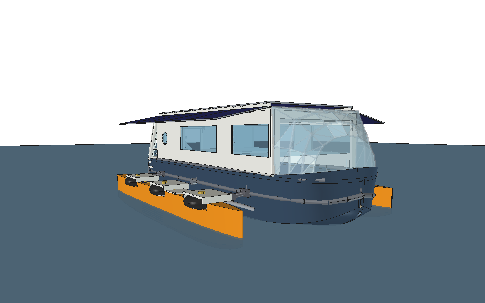
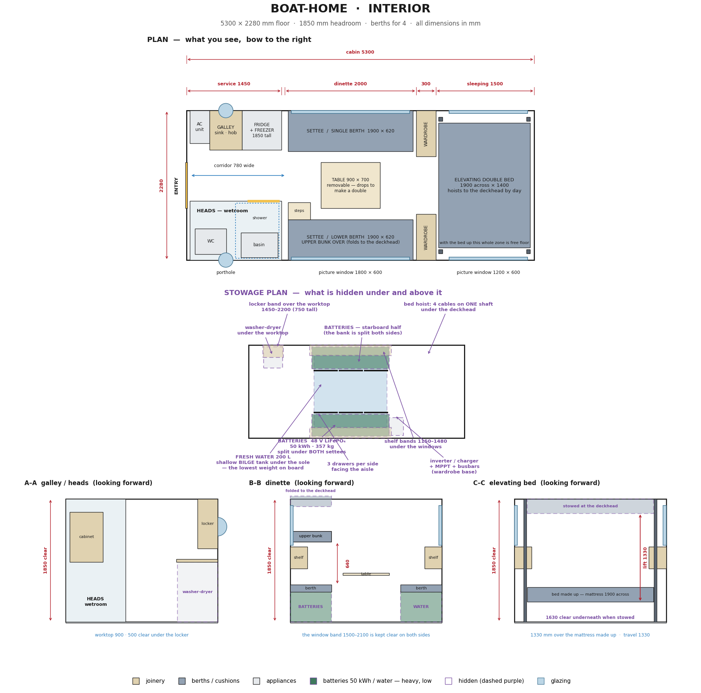
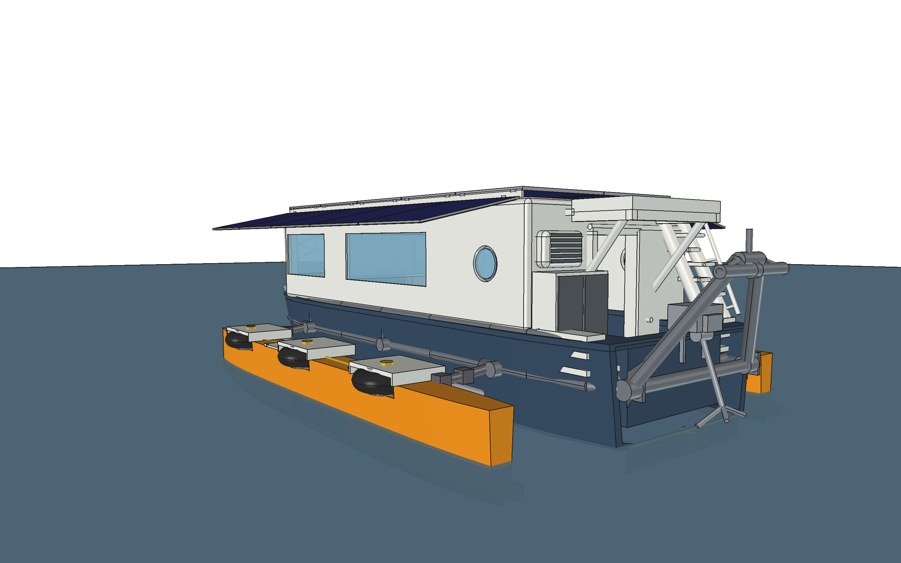
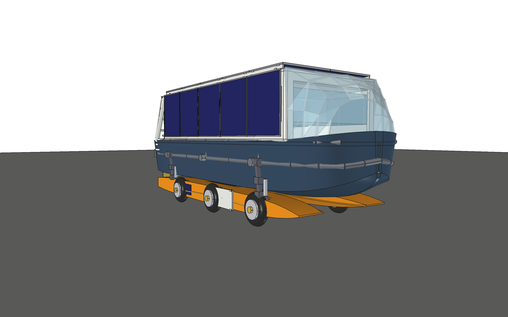
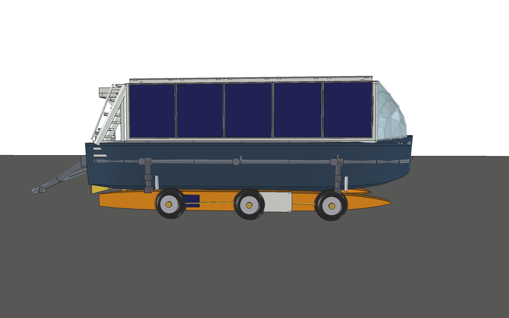
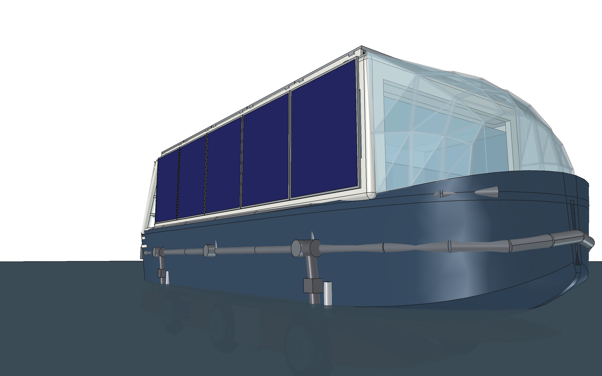
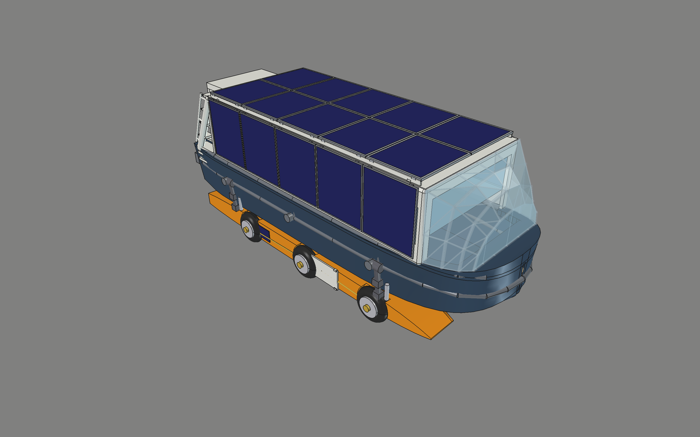
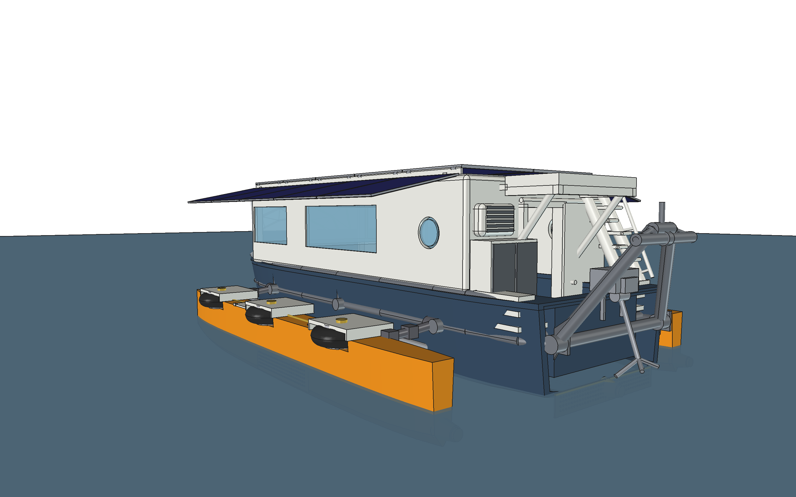
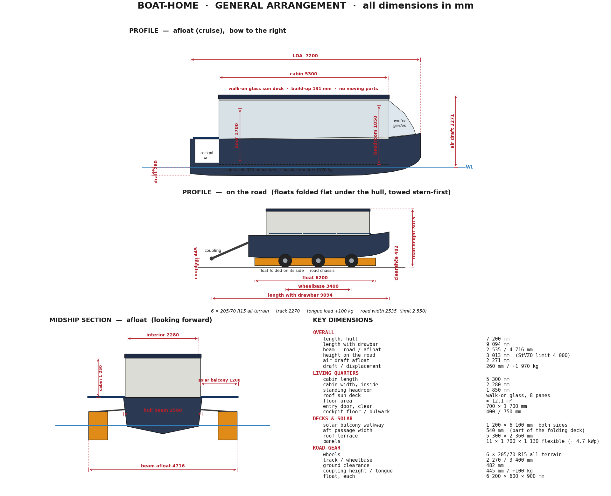
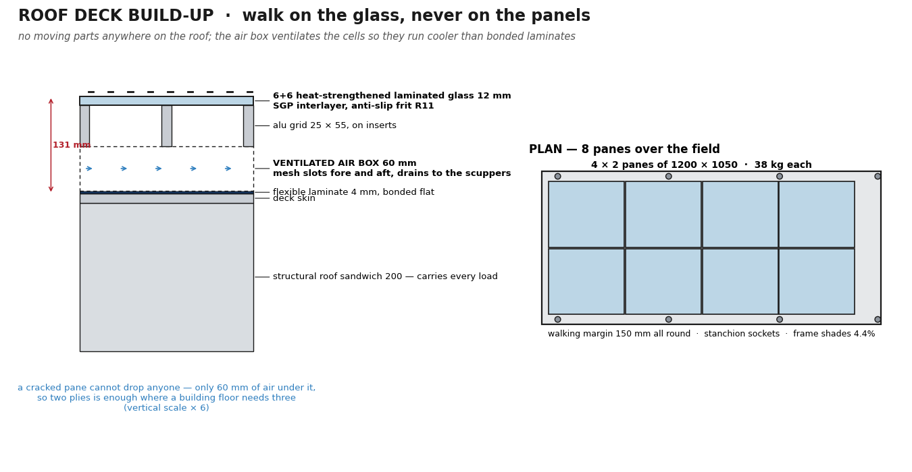

# Boat-Home — Road-Towable Solar Trimaran

A 7.2 m Dutch-barge-style boat-home that is **its own trailer**: the
stabiliser floats fold underneath the hull and carry six driven wheels,
so one Mercedes-Viano-class car tows it on German roads and it drives
itself in and out of the water on a slipway. Solar-electric, weed-proof
waterjets, and a walk-on glass sun deck — you stand on the glass, the
panels live safely underneath it.

Parametric CAD in FreeCAD (Python-scripted); every legal, structural
and hydrostatic constraint is asserted in code, so a dimension cannot
drift without the build failing.



---

## 1. Principal dimensions

| | |
|---|---|
| Length over hull | **7 200 mm** |
| Length with drawbar out | **9 094 mm** |
| Beam, hull | **2 500 mm** |
| Beam, road (folded) | **2 535 mm** (StVZO limit 2 550) |
| Beam, afloat (floats out) | **4 716 mm** |
| Height on the road | **3 002 mm** (limit 4 000) |
| Air draft afloat | **2 260 mm** |
| Draft | **328 mm** empty, **348 mm** loaded (computed from the mass) |
| Freeboard, loaded | 802 mm |
| Mass, computed | **2 948 kg** empty · **3 248 kg** with crew and stores |
| Road category | **O2 trailer, ≤ 3 500 kg** — 252 kg of margin loaded |
| Ground clearance, road | 482 mm |
| Track / wheelbase | 2 270 / 3 400 mm |
| Coupling height / tongue load | 445 mm / +100 kg |

### Living quarters

| | |
|---|---|
| Cabin | 5 300 × 2 280 mm inside |
| Headroom | **1 850 mm** clear over the sole |
| Floor area | 12.1 m² |
| Berths | **5** — athwartships double, bunk (2), single settee, dinette double |
| Heads | 1 400 × 900 wetroom with shower |
| Galley | induction hob, sink, washer-dryer, full-height fridge/freezer |
| Fresh water | 200 L in a bilge tank under the sole |
| Glazing | 2 picture windows per side, 1 800 × 600 and 1 200 × 600 |
| Sky dome | glass room forward, **no wall** — 2 040 mm portal, sole continuous, 2 050 mm head |



---

## 2. Performance

**Installed power: 3 × 2 kW flush-intake waterjets = 6 kW.** Estimates
from an ITTC friction line plus a residuary factor for a blunt barge
hull; wetted surface 28.0 m² in trimaran trim, **3 582 kg all-up — the
computed mass, wired to `params.mass_budget()`**, waterjet propulsive
efficiency 0.45. Method in
[docs/performance.md](docs/performance.md).

| Speed | Shaft power | Range on 45 kWh usable | Endurance |
|---|---|---|---|
| 2.0 kn | 0.18 kW | **488 NM** | 244 h |
| 3.0 kn | 0.58 kW | **233 NM** | 78 h |
| 3.5 kn | 1.03 kW | **153 NM** | 44 h |
| 4.0 kn | 2.15 kW | **84 NM** | 21 h |
| 4.5 kn | 4.37 kW | **46 NM** | 10 h |
| **4.7 kn max** | 6.0 kW | 32 NM | 7 h |

**Maximum ≈ 4.7 knots**, power-limited rather than hull-speed-limited
(theoretical hull speed is 6.2 kn, needing 30 kW). The last 0.2 kn costs as much power
as the first 4 — this is a boat to cruise at 3–4 kn, not to push.

**Solar-neutral cruising.** With 4.60 kWp and ≈ 24 kWh on a good summer
day, eight hours at **4.2 knots** is solar-neutral: the boat moves all day
and finishes with a fuller battery than it started. In spring or autumn
(12 kWh) that falls to 3.6 kn, and on an overcast winter day (6 kWh) to
2.7 kn.

| | |
|---|---|
| Battery | 48 V LiFePO₄, **50 kWh**, 357 kg, split under both settees |
| Structure | foam-core GRP sandwich, 103 m² of panel, **754 kg** |
| Solar | **4.60 kWp** — 10 × 230 W flexible on the roof, 10 more as side curtains (4.14 kWp effective; one panel type for the whole boat) |
| House load | ≈ 2.5 kWh/day (fridge, lights, water, AC standby) |
| Steering | differential thrust, no rudder |
| On land | ≤ 10 km/h under its own wheels; towed at road speeds |

---

## 3. The five configurations

Photo-reference renders — perspective camera, natural eye heights,
interior hidden and glazing closed so nothing reads as a cutaway — live
in `freecad/shots/beauty/`: five viewpoints per mode (bow quarter,
stern quarter, beam on, from above, low from the water), 2 800 × 1 750.
They are the plates at the front of the PDF gallery.


| Mode | What it is | Renders |
|---|---|---|
| `road` | floats folded under the hull, balconies up over the windows, towed stern-first | [bow qtr](freecad/shots/beauty/road_bow_quarter.png) · [stern qtr](freecad/shots/beauty/road_stern_quarter.png) · [beam](freecad/shots/beauty/road_beam.png) · [above](freecad/shots/beauty/road_drone.png) · [low](freecad/shots/beauty/road_low.png) |
| `launch` | driving itself down the slipway on six wheels | [bow qtr](freecad/shots/beauty/launch_bow_quarter.png) · [stern qtr](freecad/shots/beauty/launch_stern_quarter.png) · [beam](freecad/shots/beauty/launch_beam.png) · [above](freecad/shots/beauty/launch_drone.png) · [low](freecad/shots/beauty/launch_low.png) |
| `harbor` | jack-up: floats carry the boat, keel awash, tyres as rolling quay fenders | [bow qtr](freecad/shots/beauty/harbor_bow_quarter.png) · [stern qtr](freecad/shots/beauty/harbor_stern_quarter.png) · [beam](freecad/shots/beauty/harbor_beam.png) · [above](freecad/shots/beauty/harbor_drone.png) · [low](freecad/shots/beauty/harbor_low.png) |
| `cruise` | trimaran, floats out, balconies down | [bow qtr](freecad/shots/beauty/cruise_bow_quarter.png) · [stern qtr](freecad/shots/beauty/cruise_stern_quarter.png) · [beam](freecad/shots/beauty/cruise_beam.png) · [above](freecad/shots/beauty/cruise_drone.png) · [low](freecad/shots/beauty/cruise_low.png) |
| `anchor` | at anchor, held by the stern anchor | [bow qtr](freecad/shots/beauty/anchor_bow_quarter.png) · [stern qtr](freecad/shots/beauty/anchor_stern_quarter.png) · [beam](freecad/shots/beauty/anchor_beam.png) · [above](freecad/shots/beauty/anchor_drone.png) · [low](freecad/shots/beauty/anchor_low.png) |
















---

## 4. Key systems

**Hangar / running gear** — one rigid welded arm per station, a single
shoulder pin, 90° swing. Road: float on its side flush under the hull,
wheels vertical. Water: float flat, wheels dry above the waterline. Six
205/70 R15 all-terrain wheels, electric-over-hydraulic drive with the
machinery sealed inside the floats. → [docs/wheels.md](docs/wheels.md)

**Jack-up stance** — the floats hold 3.1 t of buoyancy against a 2.0 t
boat, so folding the arms in deep water lifts the *hull*: the floats end
65 % submerged carrying everything and the keel rides awash. Pontoon
GM ≈ 3.1 m.

**Propulsion** — flush perforated intake grids on the float sides below
the waterline (0.5 m/s face velocity, 14 mm holes, so weed drifts past),
internal duct to an enclosed pump, tail nozzle. Nothing rotating is
reachable by weed. → [docs/propulsion.md](docs/propulsion.md)

**Exoskeleton** — an external steel ladder-loop frame carries every
point load (arms, balconies, tow, fenders); nothing structural crosses
the living volume. → [docs/structure.md](docs/structure.md)

**Construction** — primary structure is **foam-core GRP sandwich**: PVC
and PET core, biaxial E-glass skins, epoxy, vacuum bagged, panels laid
up flat on a table and CNC-cut from the model. **103 m² of panel,
754 kg** — computed from measured areas × the laminate schedule, not
estimated. The middle 3.6 m of the hull is exactly developable, so it
needs no jig at all. → [docs/construction.md](docs/construction.md)

**Roof deck** — the solar panels **are** the guardrail. Two continuous
rows of five 230 W flexible laminates in alu frames hinge on the deck
edges: flat they cover the roof and harvest **2.30 kWp**, rotated up
they stand as a **1 234 mm barrier** and leave the whole 12.7 m² deck
free to walk on. No glass, one hinge and one catch per panel. It
replaced a walk-on glass deck that weighed 460 kg with **155 kg** — and
that deck had no guardrail at all.
→ [docs/roof.md](docs/roof.md)



**Solar curtains** — the balconies are gone. The same panel as the roof
rails, five a side, hinged on the roof-to-wall corner: closed they cover
the windows and slim the boat for the road, at 78° they project 1 129 mm
out as an awning over the glass. 2.30 kWp for **117 kg**, where the
walkable balconies were ~298 kg of frame and mechanism.
→ [docs/roof.md](docs/roof.md)

**Interior** — heads, galley, dinette that sleeps two, elevating double
bed forward, fold-down bunk to port; batteries and water low and
amidships. → [docs/interior.md](docs/interior.md)

**Front sky dome** — a glazed conservatory over the foredeck: half a
dome cut flat by the deck, so the deck is its floor and you walk into
it from the saloon — **no wall**, a 2 040 mm portal and the sole runs
straight through, 2 050 mm of headroom. Its aft rim lands exactly on
the living-quarters box corners. **51 flat panes**, all flat to
0.00 mm, on 8 meridians and **two ⌀48 tube purlins**: flat glass means
any pane can be re-cut anywhere.
→ [docs/dome.md](docs/dome.md)

**Tow and stern gear** — a wide A-arch on the transom pin-locks into a
sea gantry or an extensible drawbar; the 2 t electric self-recovery
winch and the anchor share the centreline so a ramp pull has no yaw
bias.

---

## 5. Cost estimate (2026, EUR, materials)

| Item | Low | High | Source |
|---|---|---|---|
| Foam core, PVC + PET, by zone | 3 800 | 5 200 | [construction.md](docs/construction.md) |
| Glass fabric, biax NCF, roll quantities | 2 200 | 3 000 | 203 kg dry |
| Epoxy resin, hardener, fillers | 4 500 | 6 500 | 248 kg mixed |
| Vacuum consumables | 1 200 | 2 000 | €10–20/m² per shot |
| Fairing compound, primer | 900 | 1 500 | 400 h of it |
| Tooling: pump, table, extraction, PPE | 1 500 | 2 500 | one-off |
| Exoskeleton frame + tow arch | 2 600 | 3 200 | [structure.md](docs/structure.md) |
| Wheels, hubs, in-float drive | 5 600 | 6 500 | [wheels.md](docs/wheels.md) |
| Propulsion, 3 × 2 kW waterjets | 8 800 | 13 300 | [propulsion.md](docs/propulsion.md) |
| Roof deck: 10 flexible panels, alu frames, hinges | 2 900 | 3 400 | [roof.md](docs/roof.md) |
| Solar balconies | 1 700 | 2 000 | [roof.md](docs/roof.md) |
| Battery bank, 50 kWh LiFePO₄ | 9 000 | 11 000 | at 180–220 €/kWh |
| Electrics: inverter/charger, MPPT, switchgear, cabling | 3 000 | 4 500 | est. |
| Glazing: front sky dome + windows | 6 000 | 9 000 | [dome.md](docs/dome.md) |
| Interior fit-out incl. appliances, heads, AC | 12 000 | 16 000 | est. |
| Paint, antifoul, deck finish | 2 000 | 3 000 | est. |
| Approvals: national individual approval + engineering evidence | 3 000 | 12 000 | [construction.md](docs/construction.md) | foam-core GRP: panel schedule, build sequence, shop, suppliers |
| [weight.md](docs/weight.md) | the mass problem and the 600 kg package that fixes it |
| [homologation.md](docs/homologation.md) |
| **Materials total** | **70 090** | **103 900** | |

Composite is **not cheaper on the materials line** — it is slightly
dearer than steel plate. What it removes is the fabricator's invoice,
the welding qualification and the shop equipment for a trade you would
otherwise have to learn.

**Built professionally**, add labour: ≈ 3 100 h at 60–80 €/h =
**186 000–248 000**, so a yard-built boat lands near
**260 000–360 000**. The design assumes a self-build, where that labour
is your own time — or a **split build**, which is what the yard
conversation is about: yard does hull and float panels, owner does
fit-out.

---

## 6. Build time

| Phase | Hours |
|---|---|
| Panel layup and post-cure | 250 |
| Hull and float assembly, taping, filleting | 350 |
| Fairing and coating | 400 |
| Floats, arms, wheels, hangar kinematics | 350 |
| Propulsion install and ducting | 150 |
| Roof deck, glass, solar, wiring | 200 |
| Interior joinery and fit-out | 500 |
| Electrics, plumbing, systems | 250 |
| Commissioning, trials, approvals | 150 |
| **Total** | **≈ 3 100 h** |

- **Self-build at 15 h/week** — ≈ 4 years
- **Self-build at 25 h/week** — ≈ 2.4 years
- **Professional yard, 2–3 people** — ≈ 8–11 months elapsed
- **Split build** — yard laminates and assembles the shell (≈ 1 000 h),
  owner does fit-out (≈ 2 100 h)

---

## 7. Open risks

1. **Mass: legal, but the design figure is stale.** Computed from
   measured areas × the laminate schedule plus every known fitting:
   **2 957 kg empty, 3 257 kg with crew and stores** — inside the
   3 500 kg category O2 trailer limit with 243 kg of margin, after the
   solar guardrails took 305 kg off the roof and the dome glass another
   20. `checks()` still fails against the inherited **2 000 kg** design
   figure, which predates the computed budget: it wants re-baselining or
   another 900 kg, and quietly raising it is not an option.
   The **jack-up stance** is the live one: floats give 4 152 kg, 1.27 ×
   the loaded mass where 1.40 is wanted, so the keel will not ride
   awash. That wants float *depth*, not weight — 150 mm deeper floats
   give 1.51 × inside the road-height limit.
   → [weight.md](docs/weight.md)
2. **Road beam tolerance.** 2 535 mm nominal against a 2 550 mm limit is
   **7.5 mm per side**, and a hand-laid laminate plus a fair coat eats
   5 mm of it. `checks()` now asserts the as-built beam. This is the
   most likely way the boat becomes road-illegal *after* it is built,
   and it is far cheaper to fix in `params.py` than in a mould.
3. **Fairing labour.** 400 h is the estimate for hull plus two floats.
   It is the item most likely to overrun and the one that stalls owner
   builds in year two.
4. **Workshop conditioning.** Epoxy needs 18–25 °C and stable humidity
   through two German winters — an enclosed heated space, not a tent,
   plus extraction and P3 protection for grinding cured glass.
5. **Road approval.** The folding running gear is not the problem — the
   **brake** is. Over 750 kg an overrun brake to UN R13 is mandatory and
   approvals go to catalogue axle/brake combinations, which swinging
   arms with hydraulic hub drive do not have. Cap the land drive at
   6 km/h so the vehicle stays a trailer.
   → [homologation.md](docs/homologation.md)
6. **Jet hydrodynamics** are first-order estimates — the intake grids
   want CFD or a tank test before committing.
7. **Arm and shoulder-pin fatigue** — each arm carries ~1 000 kg through
   one pin, cycled every launch.
8. **Float compartmentation is not modelled.** The floats hold the drive
   machinery *and* the reserve buoyancy. Three watertight cells per
   float is cheap now and impossible later.
   → [construction.md §8](docs/construction.md)

---

## 8. Road approval — the hangar as a trailer

Full research, sources and cost bands: [homologation.md](docs/homologation.md).

The running gear is part of the boat, so what gets registered is the
whole thing as a **category O2 trailer** (750–3 500 kg). Three findings
shape the design:

1. **Keep the land drive at ≤ 6 km/h.** German registration law applies
   to motor vehicles over 6 km/h; at or below it the wheel drive is a
   manoeuvring aid and the vehicle stays a *trailer*. Above it, the
   thing becomes an amphibious motor vehicle — a far harder approval,
   with an unresolved conflict between road and waterway marking. The
   Sealander swimming caravan is registered as a caravan and a
   category D motorboat precisely *because* it has no drive of its own.
   The design currently says 10 km/h; **6 is worth more than the 4.**
2. **The brake is the obstacle, not the folding gear.** Over 750 kg an
   overrun brake to UN R13 is mandatory, and approvals are granted to a
   *catalogue combination* of overrun device, axle and brake. Design
   the arms around a **hydraulic overrun boat-trailer brake set** and
   the paperwork comes free with the parts; invent a brake and it is a
   five-figure test programme.
3. **There is no EU-wide route.** EU individual approval covers only M1
   and N1, so a trailer gets a *national* individual approval, valid in
   the issuing state; other states "shall permit" it unless they doubt
   equivalence (Art. 46, Reg. 2018/858). **Register where you live** —
   Germany requires re-registration within 12 months of a resident
   bringing a vehicle in.

| Country | Fees + engineering | Elapsed | Notes |
|---|---|---|---|
| **Germany** — § 21 StVZO / § 13 EG-FGV | **≈ 3 000–12 000** | 4–10 months | inspector-led; a plain self-built trailer goes through for ≈ €430, and that is the floor |
| **Portugal** — IMT homologação individual | **≈ 1 700–6 500** | 4–12 weeks | document-led; €160 homologation + €45 matrícula, but IMT may demand accredited lab tests |
| **Netherlands** — RDW individual approval | ≈ 250–300 in fees | weeks | the most transparent price list in the EU |

**Next step, before more CAD:** buy a €300–800 pre-assessment from a
technical service and get the required evidence in writing.

---

## 9. Documents

| Document | Covers |
|---|---|
| [performance.md](docs/performance.md) | speed, range, the resistance model |
| [wheels.md](docs/wheels.md) | hangar kinematics, in-float drive, BOM |
| [propulsion.md](docs/propulsion.md) | waterjets, weed strategy, BOM |
| [structure.md](docs/structure.md) | exoskeleton frame, tow arch, stern gear |
| [roof.md](docs/roof.md) | solar guardrails, the deck, the balconies |
| [homologation.md](docs/homologation.md) | road approval: trailer vs amphibian, brakes, DE/PT/NL cost and time |
| [dome.md](docs/dome.md) | front sky dome: flat glazing, the two tubes, the open portal |
| [interior.md](docs/interior.md) | layout, stowage, services, mass budget |
| [aft_entry.md](docs/aft_entry.md) | companionway, porch, ladder, AC, lockers |
| [glossary.md](docs/glossary.md) | vocabulary for every part and term |

---

## 10. Repository layout

```
freecad/            the model — the source of truth
  params.py         ALL dimensions, kinematics, checks() asserts
  build_boat.py     geometry builders -> boat_<mode>.FCStd
  view.sh           build + open in the FreeCAD GUI
  beauty_shots.py   perspective photo-reference renders -> shots/beauty/
  ga_drawing.py     dimensioned general-arrangement sheet
  interior_plan.py  interior sheet: plan + stowage plan + sections
  roof_cards.py     roof-deck spec cards
  shots/beauty/     the renders (perspective, exterior, never stale)
docs/
  *.md              per-system design studies (table above)
  images/           dimensioned spec cards and drawings
  make_pdf.py       renders this README to docs/boat-home.pdf
drafts/             original concept PDF + STL sketch
*.scad, Makefile    legacy OpenSCAD sketch (superseded)
```

## 11. Working on it

```sh
./freecad/view.sh                              # open in the GUI
~/bin/FreeCAD.AppImage freecad/beauty_shots.py # regenerate all renders
python3 freecad/ga_drawing.py                  # arrangement sheet
python3 freecad/interior_plan.py               # interior sheet
python3 freecad/roof_cards.py                  # roof spec cards
python3 docs/make_pdf.py                       # this README as a PDF
python3 -c "import sys; sys.path.insert(0,'freecad'); import params; params.checks()"
```

`params.py` is the single source of truth. `checks()` recomputes road
legality (StVZO), submergence margins, stability, glass thickness, panel
fit and interior clearances from the same numbers the geometry uses —
change a dimension and the asserts tell you what broke.

---

© 2026 Max Brito. All rights reserved.
Contact: [maxbrito@pm.me](mailto:maxbrito@pm.me)
