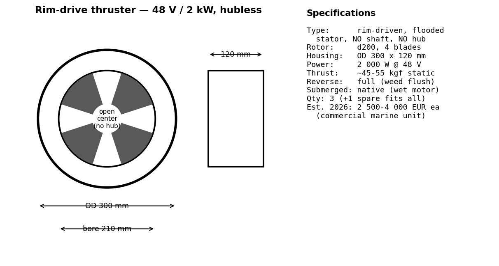
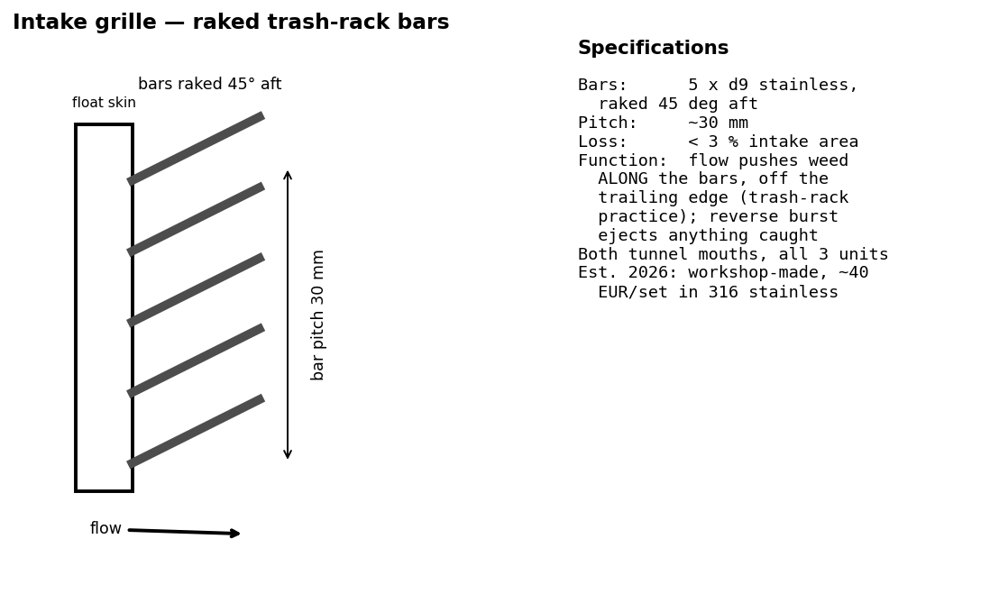

# Propulsion — Weed-Proof Rim-Drive Thrusters

Status: design study. Geometry in `freecad/params.py` (`THRUSTER_*`,
`MAIN_THRUSTER`), shapes in `freecad/build_boat.py`, submergence
asserted in `checks()`. Terms in [glossary.md](glossary.md).

## 1. Layout

Three identical **rim-drive tunnel thrusters**, 48 V / **2 000 W each**
(Max's cap):

| Position | Where | Role |
|---|---|---|
| Float, stbd | tunnel through the float tail, 160 mm below WL | maneuver + redundancy + steering |
| Float, port | mirror | maneuver + redundancy + steering |
| Main hull | nacelle behind the transom, tucked above keel line | primary cruise drive |

One spare unit in the workshop fits all three positions.

## 2. Why rim-drive (the seaweed answer)

The classic weed failure is vegetation wrapping the **shaft** behind a
propeller hub. A rim-driven thruster has **no shaft and no hub** — the
blades are carried by a motor ring at the tip; the center is open
water. Combined defenses, outside → in:

1. **Raked intake grilles** at both tunnel mouths — 5 stainless bars,
   ⌀9 mm at ~30 mm pitch, raked 45° aft (trash-rack practice): flow
   pushes weed *along* the bars and off the trailing edge instead of
   pinning it flat. Intake-area loss < 3 %.
2. **Tunnel placement** — float tunnels sit 160 mm under the surface,
   *below* the floating-weed layer but high above the bottom.
3. **Hubless rotor** — nothing to wrap; fibrous weed that enters gets
   chopped at the blade tips where the ring shears it.
4. **Reverse flush** — all units fully reversible; the helm gets a
   one-button "weed" function: 5 s full reverse back-flushes the
   tunnel and grille.
5. **Deck access hatch** over each float tunnel for manual clearing.

Spec cards:  

## 3. Steering & handling

No rudder. The float thrusters sit ~5 m apart — **differential
thrust** gives more yaw authority than any rudder at ≤ 10 km/h:
- cruise: main unit only, floats trimming heading
- docking: floats counter-rotating spin the boat in place; combined
  with fore/aft bursts the boat crab-walks to the quay
- foiling/high drag: all three at full power

## 4. Energy & speed (moderate by design)

| Condition | Units running | Power | Speed est. |
|---|---|---|---|
| Canal cruise | main only | ~1.2 kW | ~4.5 kn (8.3 km/h) |
| Fast cruise | main + floats low | ~2.5 kW | ~5.5 kn (hull speed region) |
| Sprint / maneuver | all three | 6 kW max | short bursts, docking, foil takeoff assist |

6 kW peak sits inside the 5.2 kWp solar array + 48 V bank; a sunny-day
canal cruise is energy-neutral around 1.2–1.5 kW draw. (Reference: the
Solaris 12.5 sheet cruised a 4.6 t hull at 5 kn on 2.8 kW; this hull is
half the displacement.)

## 5. Main pieces, 2026 cost estimate & references

| # | Item | Qty | Est. € each | Est. € total | Where to see it |
|---|---|---|---|---|---|
| 1 | Rim-drive thruster 48 V 2 kW (⌀300 housing) | 3 (+1 spare) | 2 500–4 000 | 7 500–12 000 | <https://rimdrivetechnology.nl> · <https://www.epropulsion.com> (pod class) |
| 2 | Motor controller / VESC-class 48 V 100 A | 3 | 180 | 540 | <https://vesc-project.com> |
| 3 | Intake grilles, 316 stainless, workshop-made | 6 | 40 | 240 | local metal shop |
| 4 | Tunnel liners GRP + hatches | 2 | 150 | 300 | boatyard consumables |
| 5 | Cabling 48 V + wet-mate pairs (floats) | 2 | 120 | 240 | see wheels.md item 8 |
|   | **Total propulsion** | | | **≈ 8 800–13 300** | |

Budget path: DIY rim-drive kits and Chinese ring thrusters exist at
~€600–900/unit (quality lottery); or fall back to shrouded pod +
weed cutter (~€700/unit) using the same tunnels — the geometry does
not change, only the cartridge in the ring seat.

## 6. Model objects (FreeCAD tree)

`ThrusterStb/Port` — ring + hubless blades + both grilles in the float
tails. `MainThruster` — pylon + ring + grilles behind the transom.
Tunnel bores are cut into the float tail cones. In road pose the float
tunnels point sideways under the hull: dry, protected, nothing outside
the 2 550 mm envelope.
