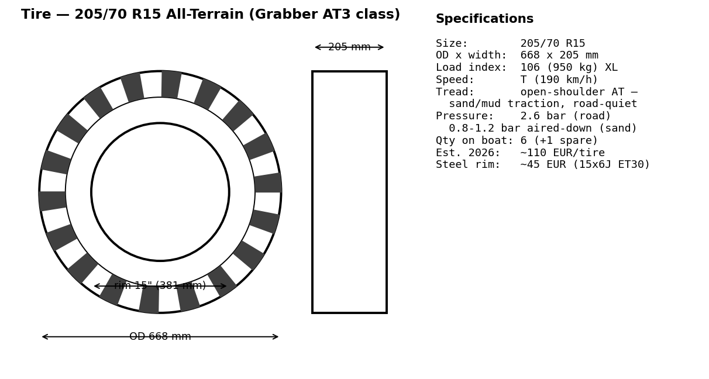
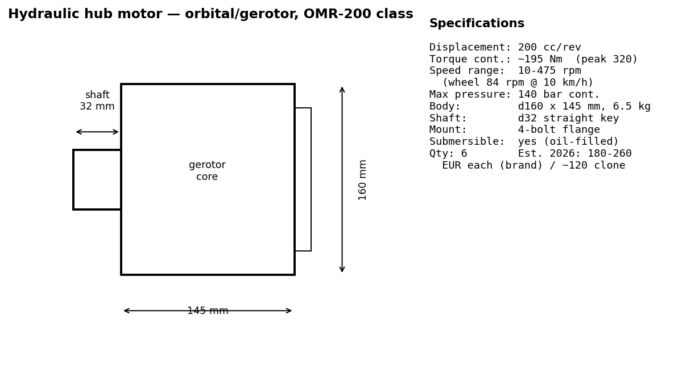
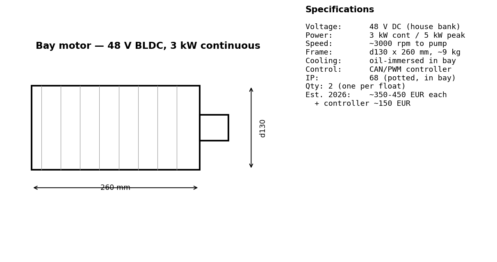
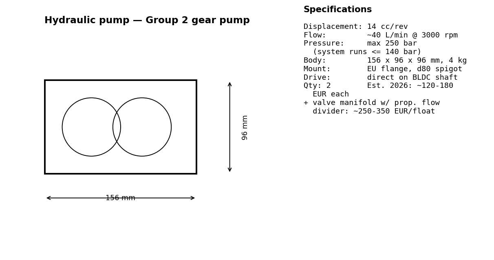
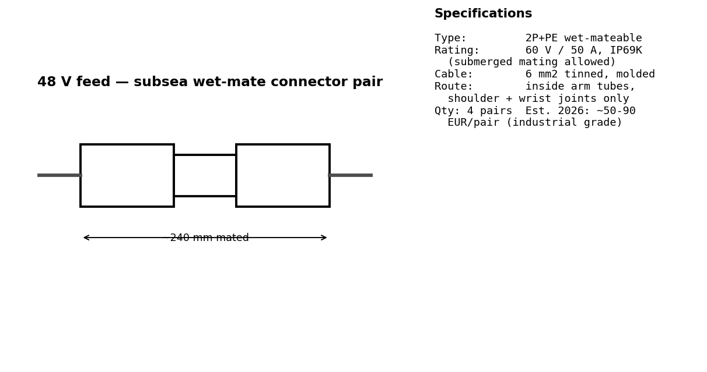
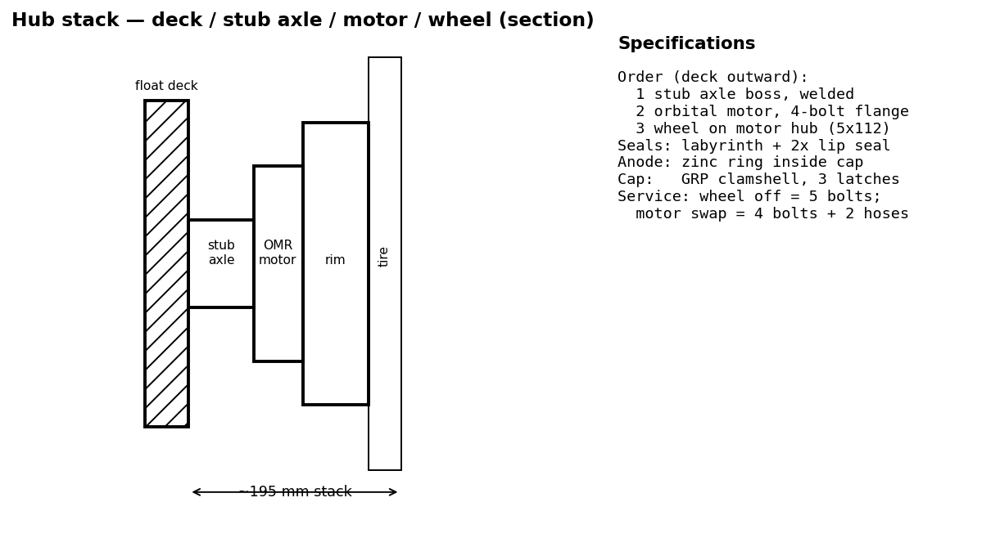

# Wheel System — Mechanism & Drive

Status: design study. Geometry lives in `freecad/params.py` (single source
of truth, asserted by `checks()`); shapes in `freecad/build_boat.py`.

## 1. Concept

The stabilizer floats ARE the road gear ("the hangar"). Each float
carries three wheels; the same six wheels that make the boat a trailer on
the German road also drive it up and down slipways, and act as rolling
rubber fenders against harbour walls. No separate trailer exists.

## 2. Wheels

| Item | Value | Why |
|---|---|---|
| Tire | **205/70 R15 All-Terrain** (⌀668 × 205 mm) | Standard 15" size (any tire shop) in an AT tread: open shoulders bite in sand and mud (air down to ~1 bar on soft slipways), quiet and low-friction enough for 100 km/h road towing. 106T XL = 950 kg/tire, 6 tires ≫ 2 t |
| Count | 6 (3 per float, at x 1300 / 3000 / 4700 from the transom) | 3.4 m wheelbase; wheel-group centroid ~300 mm aft of the center of mass → ~100 kg tongue load |
| Track | 2 270 mm | contact patches near the hull edge, stable for a 2.8 m tall trailer |
| Mounting | **Caster-style stub axle, perpendicular to the float deck**, disc half-recessed in a deck well, axle dropped 60 mm | see §3 — this single choice makes the 90° float roll work |

## 3. Kinematics — why the wheels are casters

Each float hangs on rigid welded arms (straight segments cut at angles
that follow the hull cross-section) with a single shoulder pivot at the
gunwale, plus a wrist pivot that rolls the float **90°** between poses:

- **Road / launch / harbour (roll 90°)** — the float lies on its SIDE,
  pressed flush against the hull bottom (mating face beveled 12° to
  match the deadrise). The stub axles are then **horizontal → wheel
  discs vertical**, rolling correctly with a direct load path
  tire → axle → float structure → arm → hull. Under-keel stack is only
  465 mm; total road height 2.80 m.
- **Cruise / anchor / foiling (roll 0°)** — the float sits flat on the
  water. The axles are then **vertical → wheels lie FLAT on the float
  deck**, half-recessed in their wells under low covers, ~470 mm above
  the waterline. Minimal windage, nothing to snag.

A wheel plane stays exactly vertical at both working roll angles; camber
exists only mid-transition, when the wheels are unloaded.

## 4. Fender function

The wheel covers are **open on the outboard side**: the tire edge stands
77 mm proud of the float side (water pose) and ~12 mm proud of the hull
(harbour pose, floats folded under in the water). Docked against a quay
wall the boat touches rubber first, and because the wheels spin freely
they *roll* along the wall as the boat surges — the Solaris-sheet idea
"wheels roll along the quay as fenders", made geometrically true.

## 5. Drive — electric over hydraulic, machinery inside the float

Requirements: electric, ≤ 10 km/h, must function underwater (the wheels
sit submerged for extended periods in harbour pose).

**Architecture per float:**

```
48 V house bank ──(cable through the arm tubes, wet-mate connectors)──►
  Machinery bay in the float (watertight, gasketed deck hatch):
    48 V BLDC motor ~3 kW ─► gear pump ─► valve manifold + reservoir
      ─► short internal hoses ─► 3 hydraulic orbital wheel motors (hubs)
```

- **Orbital (gerotor) hub motors** — Danfoss OMR / White RE class.
  Oil-filled by construction: they operate submerged without any special
  sealing. At 10 km/h the wheels turn ~84 rpm; orbital motors produce
  their 200–400 Nm exactly in that speed band, no gearbox needed.
- **Torque check**: worst case 1 900 kg on a 15 % slipway with rolling
  resistance ≈ 3.4 kN tractive force → ~180 Nm per wheel across 6
  wheels. One orbital motor per hub covers it with margin.
- **Power check**: ~1.6 kW to hold 10 km/h on flat ground; ~3.4 kW peak
  on the ramp → one 2.5–3 kW pump per float from the 48 V bank.
- **Nothing hydraulic crosses a joint**: pump, manifold and hubs are all
  on the same rigid float; hoses are short internal runs. Only the 48 V
  cable crosses the wrist and shoulder, inside the arm tubes, with
  wet-mate connectors — the only failure-prone interface is a plug.
- **Water strategy**: the bay is IP68 with a pressure-relief valve, and
  it is *allowed* to flood without consequence to propulsion — the
  hydraulic loop is closed and the motor is potted. Zinc anodes at each
  hub, labyrinth + lip seals on the stub axles, freshwater flush port
  for after-salt rinse.
- **Control**: each bay's valve manifold gives forward/reverse and
  left/right speed differential → skid-steering at walking pace; no
  steered axle needed at ≤ 10 km/h.

## 6. Main pieces, 2026 cost estimate & references

Spec cards with dimensions for each item are in [`images/`](images/).
Prices are 2026 street-price estimates (EUR, excl. VAT variation);
URLs are representative product/category pages to see the item class.

| # | Item | Qty | Est. € each | Est. € total | Spec card | Where to see it |
|---|---|---|---|---|---|---|
| 1 | Tire 205/70 R15 AT (General Grabber AT3 or BFG Trail-Terrain) | 6 + 1 spare | 110 | 770 |  | <https://www.generaltire.com/tires/grabber-at3> · <https://www.reifen.com> |
| 2 | Steel rim 15×6J ET30, 5×112 | 7 | 45 | 315 | (std. automotive) | <https://www.felgenshop.de> |
| 3 | Orbital hub motor, OMR-200 class | 6 | 220 | 1 320 |  | <https://www.danfoss.com/en/products/dps/hydraulic-motors/> · budget: <https://www.hydraulikpaule.de> |
| 4 | 48 V BLDC motor 3 kW + controller | 2 | 550 | 1 100 |  | <https://www.goldenmotor.com> · <https://www.kellycontroller.com> |
| 5 | Group-2 gear pump 14 cc | 2 | 150 | 300 |  | <https://www.hydraulikshop24.de> |
| 6 | Valve manifold + proportional flow divider | 2 | 300 | 600 | (per system spec) | <https://www.hydac.com> |
| 7 | Hose, fittings, reservoir, filter (per float set) | 2 | 200 | 400 | — | local hydraulic supplier |
| 8 | Wet-mate 48 V connector pair | 4 | 70 | 280 |  | <https://www.bluetrailengineering.com/connectors> · <https://www.macartney.com/subconn> |
| 9 | Stub axles, seals, zinc anodes, caps (per hub) | 6 | 80 | 480 |  | machined + std. seal cat. (SKF/CR) |
|   | **Total drive + wheels** | | | **≈ 5 600** | | |

For scale: the original Solaris 12.5 sheet budgeted €4 800 for "amas,
beams, wheels" — same order of magnitude, one size smaller boat.

### Tire choice note

Requirement: traction on **sand and mud** (slipways, beaches) plus
normal **road** towing with low rolling resistance. Best match: a
light-truck **All-Terrain** pattern in a standard 15" size —
open shoulder blocks self-clean in mud, a dense center rib keeps road
noise/rolling resistance acceptable, and the XL casing tolerates
airing down to ~0.8–1.2 bar for soft sand (reinflate for the road).
Candidates: General Grabber AT3 205/70 R15 96T, BFGoodrich
Trail-Terrain T/A, Falken Wildpeak A/T. Avoid pure mud-terrain (MT)
tires: loud, heavy, poor 100 km/h manners.

## 7. Model objects (FreeCAD tree)

`DriveHatchStb/Port` — gasketed bay hatch on the float deck.
`HydraulicsStb/Port` — motor + pump block, hoses to each hub, goldenrod
hub-motor caps. `TireStb*/RimStb*` — wheels. `WheelBoxesStb/Port` —
open fender covers (water pose only). Hide `FloatStb/Port` in the model
tree to look inside the bay.
